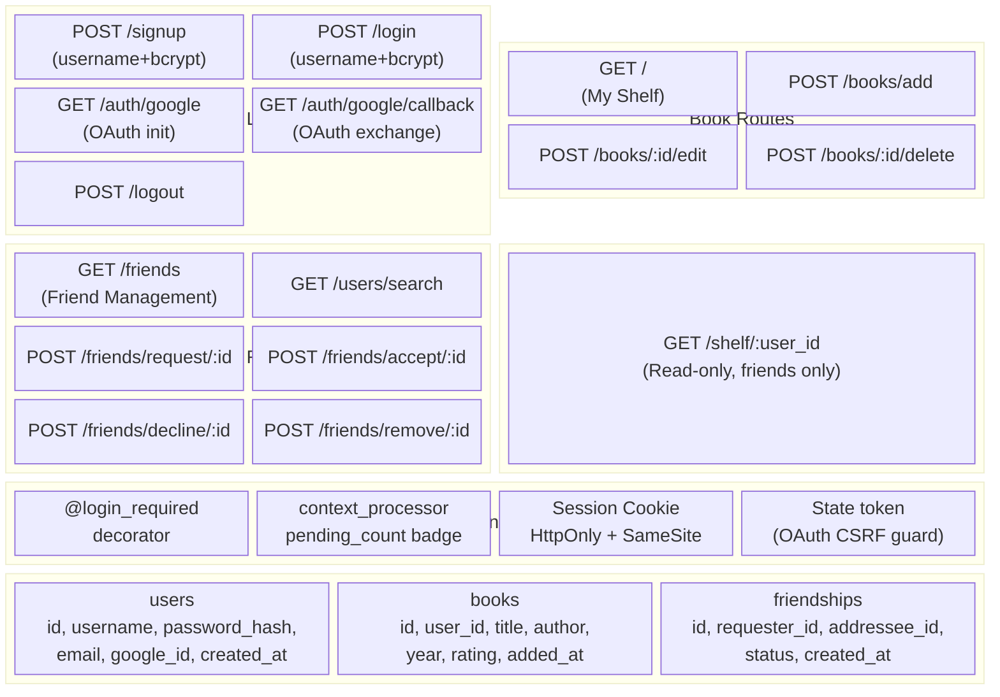
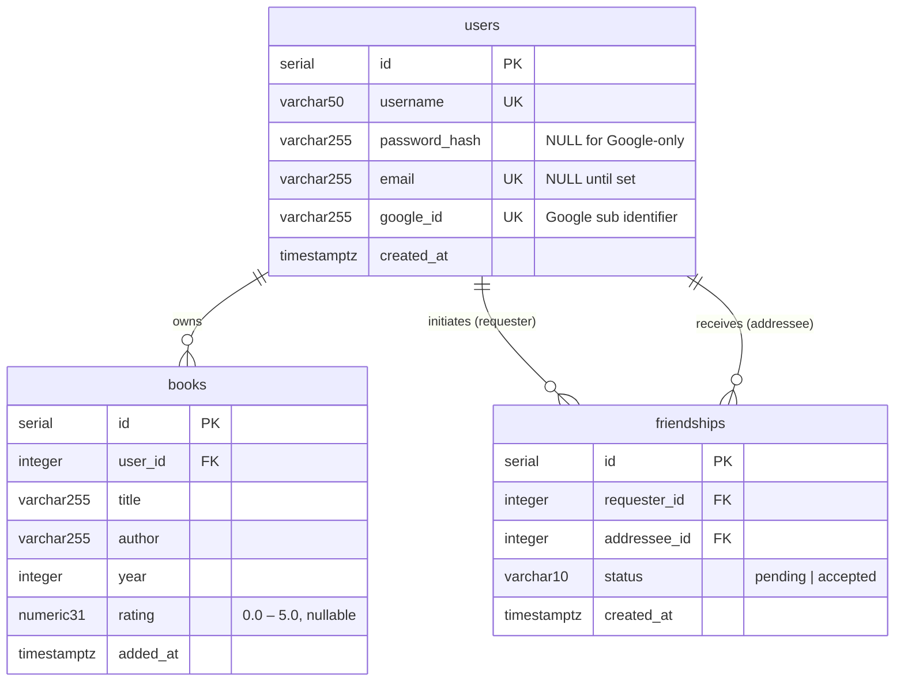
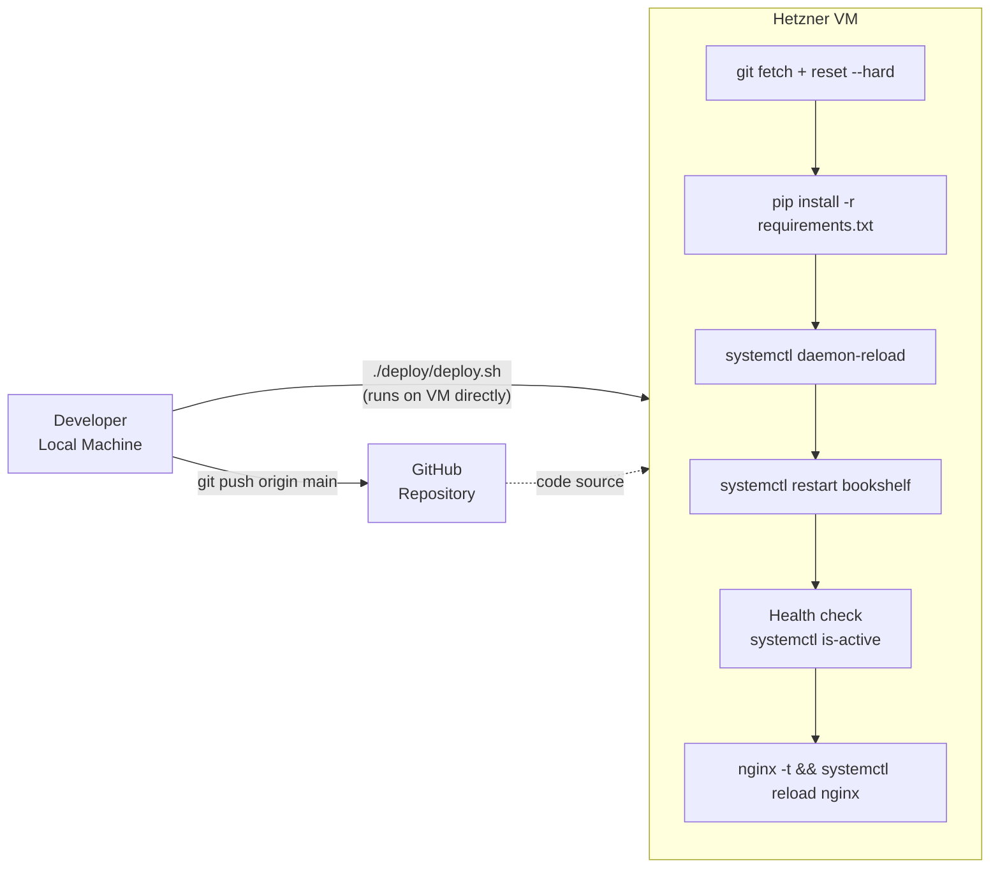

# Bookshelf — System Architecture

## Overview

Bookshelf is a social book-tracking web application. Users maintain a personal shelf of books they have read, connect with friends, and browse each other's shelves. The stack is **Flask → Gunicorn → PostgreSQL**, deployed on a single Hetzner VM behind Nginx with HTTPS via Let's Encrypt.

---

## Infrastructure Layout

```mermaid
block-beta
  columns 3

  Internet(["Internet / Browser"]):::ext
  space
  DDNS(["nbookshelf.ddns.net\n(No-IP DDNS)"]):::ext

  space:3

  block:VM["Hetzner Cloud VM"]:3
    columns 3
    Nginx["Nginx\n(Reverse Proxy + TLS)"]:::infra
    space
    Static["Static Files\n/static/ (served by Nginx)"]:::infra

    space:3

    Gunicorn["Gunicorn\n(2 workers, Unix socket)"]:::app
    space
    Env[".env\n(Secrets)"]:::cfg

    space:3

    Flask["Flask Application\napp.py"]:::app
    space
    Venv["Python venv\n/srv/bookshelf/venv"]:::cfg

    space:3

    Postgres["PostgreSQL\nbk_db"]:::db
    space
    Logs["Log Files\n/var/log/bookshelf/"]:::cfg
  end

  space:3

  GoogleOAuth(["Google OAuth 2.0\naccounts.google.com"]):::ext
  space
  hCaptcha(["hCaptcha\napi.hcaptcha.com"]):::ext

  Internet --> DDNS
  DDNS --> Nginx
  Nginx --> Gunicorn
  Nginx --> Static
  Gunicorn --> Flask
  Flask --> Postgres
  Flask --> GoogleOAuth
  Flask --> hCaptcha

  classDef ext fill:#dbeafe,stroke:#3b82f6,color:#1e40af
  classDef infra fill:#fef9c3,stroke:#ca8a04,color:#713f12
  classDef app fill:#dcfce7,stroke:#16a34a,color:#14532d
  classDef db fill:#fce7f3,stroke:#db2777,color:#831843
  classDef cfg fill:#f3f4f6,stroke:#6b7280,color:#374151
```

---

## Application Component Map



---

## Data Model (Entity-Relationship)



---

## Deployment Pipeline



---

## Process & Networking

```mermaid
block-beta
  columns 3

  Client(["Browser"]):::ext
  space
  LetsEncrypt(["Let's Encrypt\nCertbot"]):::ext

  space:3

  block:NginxBlock["Nginx (port 80 / 443)"]:3
    columns 3
    TLS["TLS Termination\n(fullchain + privkey)"]
    StaticServe["Static Files\n7-day cache"]
    ProxyPass["proxy_pass to\nUnix socket"]
  end

  space:3

  block:GunicornBlock["Gunicorn (Unix socket: /run/bookshelf/bookshelf.sock)"]:3
    columns 3
    W1["Worker 1"]
    W2["Worker 2"]
    Systemd["systemd unit\nbookshelf.service"]
  end

  space:3

  PG["PostgreSQL\nlocalhost:5432"]:::db

  Client -->|HTTPS 443| TLS
  LetsEncrypt --> TLS
  TLS --> ProxyPass
  ProxyPass --> W1
  ProxyPass --> W2
  W1 --> PG
  W2 --> PG

  classDef ext fill:#dbeafe,stroke:#3b82f6,color:#1e40af
  classDef db fill:#fce7f3,stroke:#db2777,color:#831843
```
