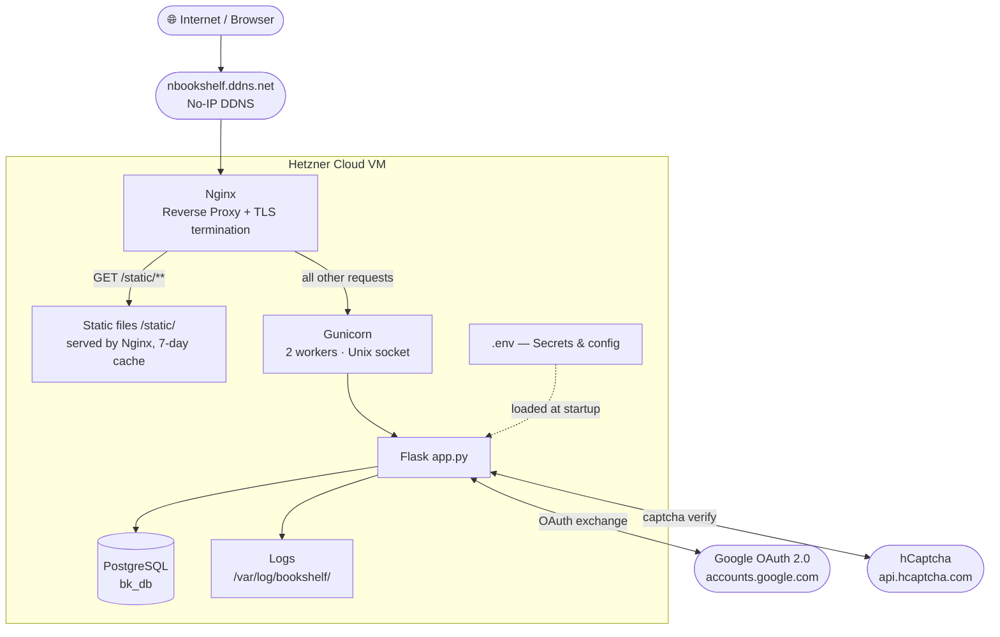
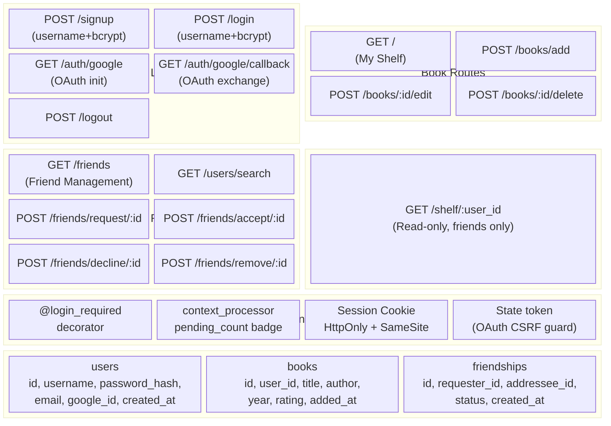
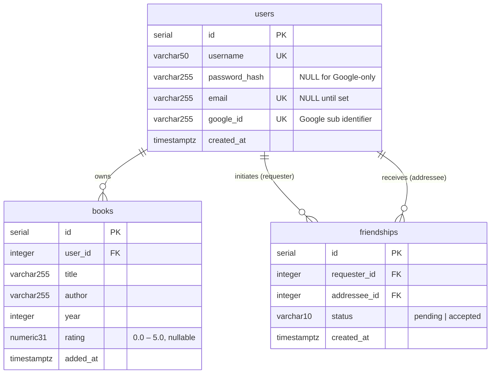
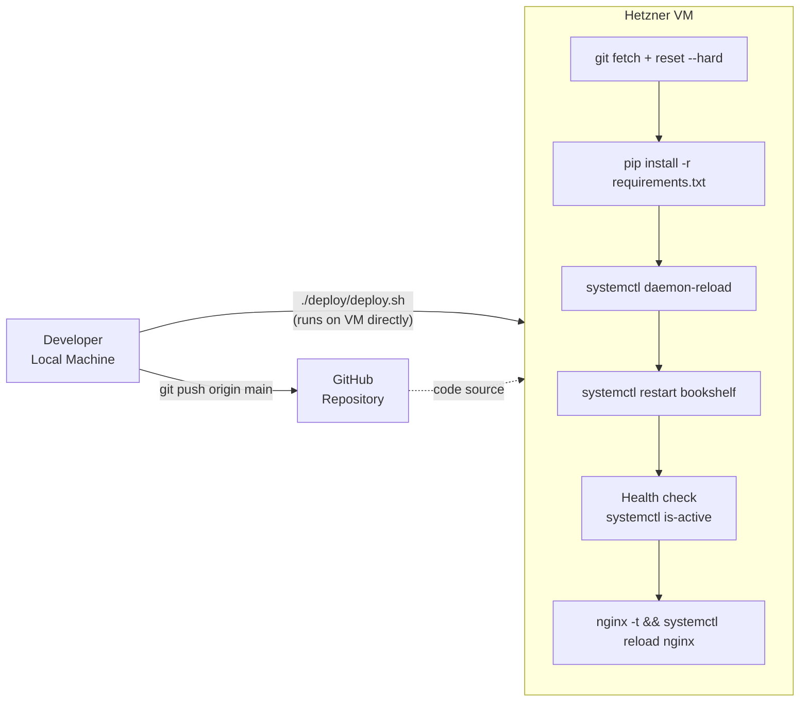
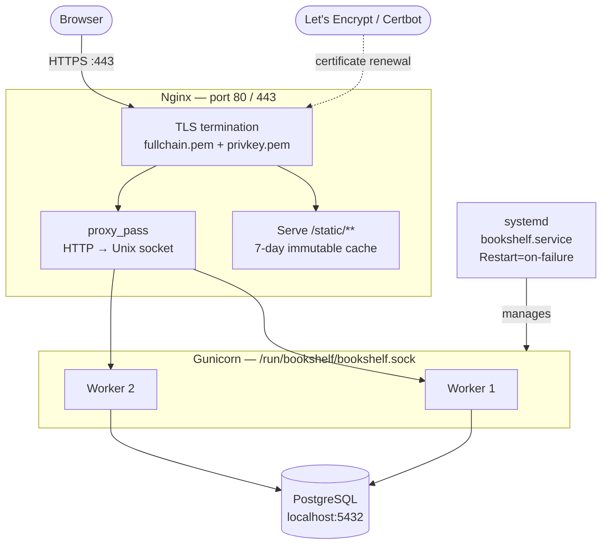

# Bookshelf — System Architecture

## Overview

Bookshelf is a social book-tracking web application. Users maintain a personal shelf of books they have read, connect with friends, and browse each other's shelves. The stack is **Flask → Gunicorn → PostgreSQL**, deployed on a single Hetzner VM behind Nginx with HTTPS via Let's Encrypt.

---

## Infrastructure Layout

---

## Application Component Map

---

## Data Model (Entity-Relationship)

---

## Deployment Pipeline

---

## Process & Networking

