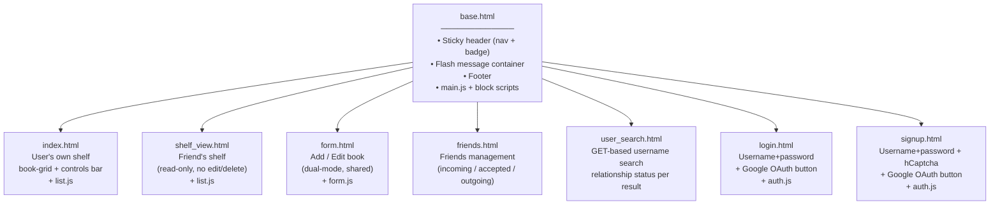
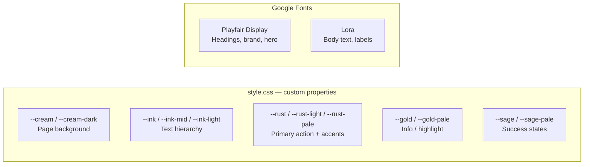
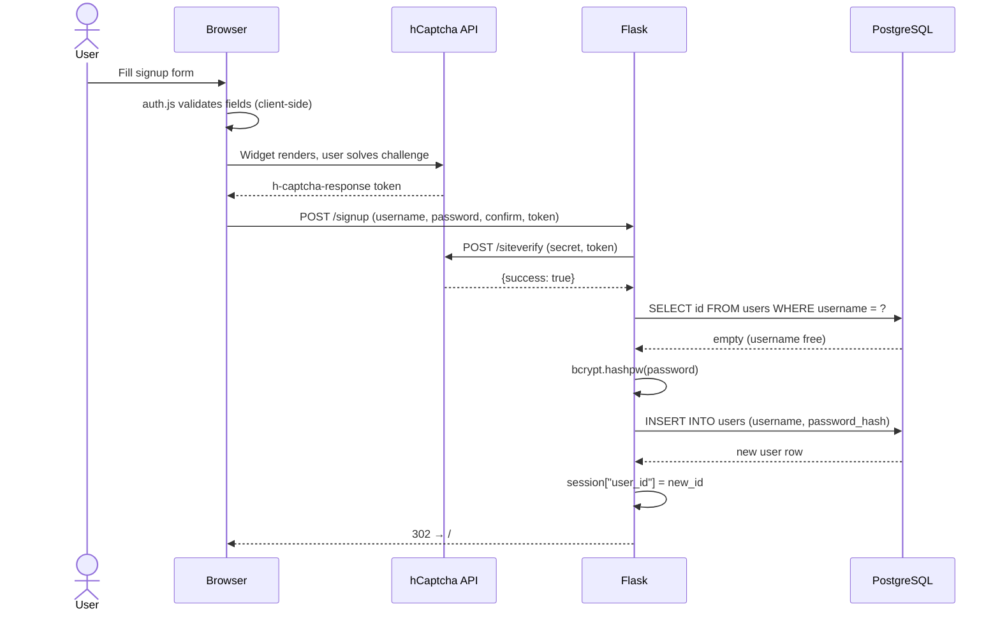
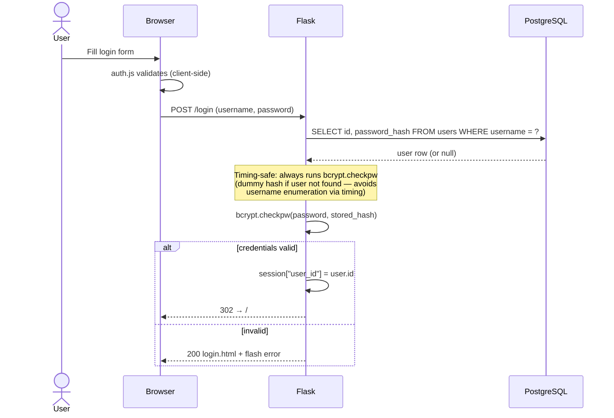
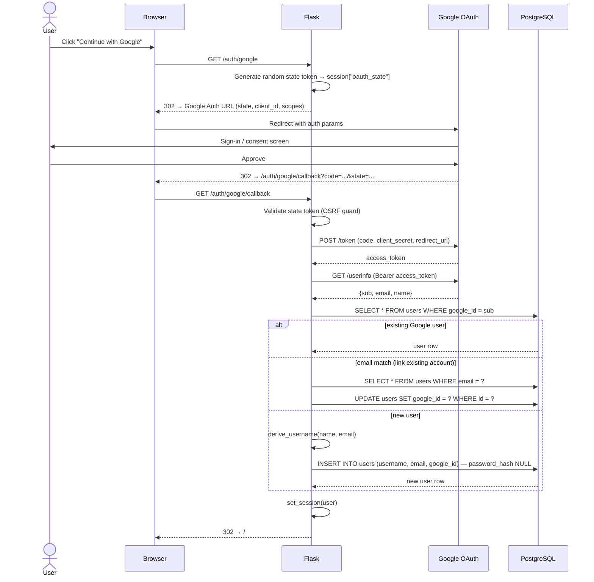
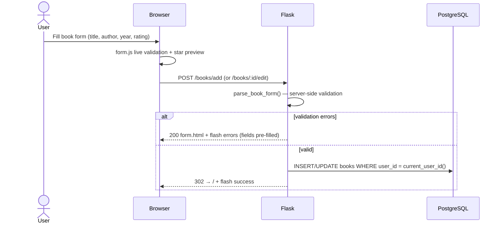
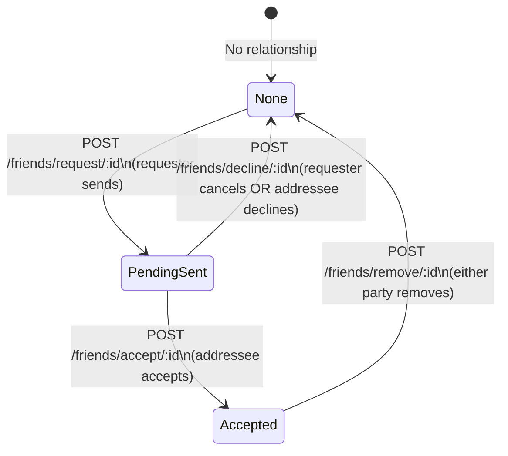
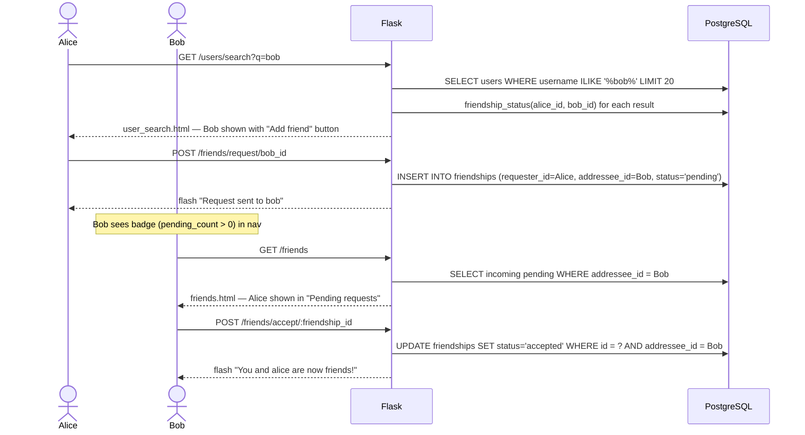
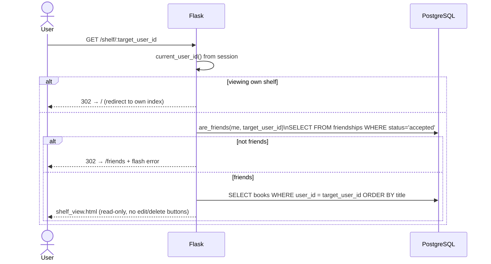

# Bookshelf — Design Reference

## 1. Frontend Layer

### 1.1 Template Inheritance

All pages extend `base.html` which owns the sticky header, flash messages, footer, and shared script tags.



### 1.2 JavaScript Responsibilities per Page

| Script | Pages loaded on | Responsibility |
|--------|----------------|----------------|
| `main.js` | All pages (via `base.html`) | Auto-dismiss flash messages after 4 s; `confirmDelete()` dialog for book removal |
| `list.js` | `index.html`, `shelf_view.html` | Client-side live search (debounced 180 ms), min-rating filter, sort by title / author / year / rating — all operating on `data-*` attributes embedded in each `.book-card` |
| `auth.js` | `login.html`, `signup.html` | Inline field validation on blur/input; show/hide password toggle; password strength meter (0–4 score) on signup |
| `form.js` | `form.html` | Field validation (title, author, year, rating), live character counter for title (255 max), live star-fill preview as rating is typed |

### 1.3 CSS Design Tokens



Book cards on the shelf use a `.book-spine` / `.book-spine--friend` left-border accent to visually distinguish own books (rust) from a friend's shelf (alternative colour).

---

## 2. Authentication Design

### 2.1 Username / Password Sign-up Flow



### 2.2 Username / Password Login Flow



### 2.3 Google OAuth 2.0 Flow



### 2.4 Session & Cookie Security

| Property | Value |
|----------|-------|
| `SESSION_COOKIE_HTTPONLY` | `True` — JavaScript cannot read the cookie |
| `SESSION_COOKIE_SAMESITE` | `Lax` — blocks cross-site form-based CSRF |
| `SESSION_COOKIE_SECURE` | `True` when `FORCE_HTTPS=true` (production) |
| OAuth CSRF | Random `state` token stored in session, verified on callback |
| Login timing | Dummy `bcrypt.checkpw` always runs to prevent username enumeration |

---

## 3. Book Management

### 3.1 Add / Edit Book Flow



Delete is a `POST /books/:id/delete`. The route guards with `user_id = current_user_id()` so users can never delete another person's book, even with a crafted request.

---

## 4. Social Features

### 4.1 Friend Request Lifecycle





### 4.2 Friend's Shelf — Access Control



### 4.3 Pending Count Badge

A `@app.context_processor` runs on every request for authenticated users. It queries:

```sql
SELECT COUNT(*) AS n
FROM friendships
WHERE addressee_id = :me AND status = 'pending';
```

The result is injected as `{{ pending_count }}` into `base.html`, rendering a badge in the Friends nav link. Exceptions are swallowed silently so a DB hiccup never crashes the entire page render.

---

## 5. Route Map Summary

| Method | Path | Auth | Description |
|--------|------|------|-------------|
| GET | `/` | ✅ | User's own shelf |
| GET / POST | `/signup` | ❌ | Create account (username + bcrypt + hCaptcha) |
| GET / POST | `/login` | ❌ | Login with username + password |
| POST | `/logout` | ✅ | Clear session |
| GET | `/auth/google` | ❌ | Initiate Google OAuth |
| GET | `/auth/google/callback` | ❌ | OAuth exchange + session creation |
| GET / POST | `/books/add` | ✅ | Add a book to shelf |
| GET / POST | `/books/<id>/edit` | ✅ | Edit own book |
| POST | `/books/<id>/delete` | ✅ | Delete own book |
| GET | `/friends` | ✅ | Friend management page |
| GET | `/users/search` | ✅ | Search users by username |
| POST | `/friends/request/<id>` | ✅ | Send friend request |
| POST | `/friends/accept/<id>` | ✅ | Accept incoming request |
| POST | `/friends/decline/<id>` | ✅ | Decline / cancel request |
| POST | `/friends/remove/<id>` | ✅ | Remove accepted friend |
| GET | `/shelf/<user_id>` | ✅ | View a friend's shelf (read-only) |
